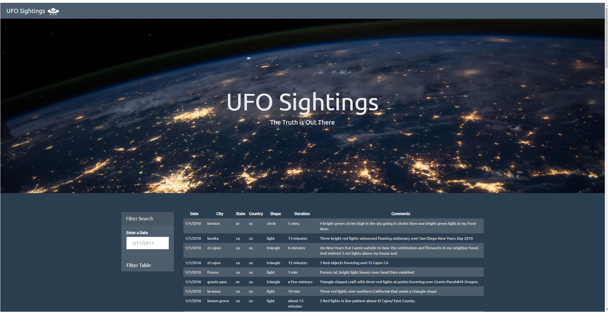
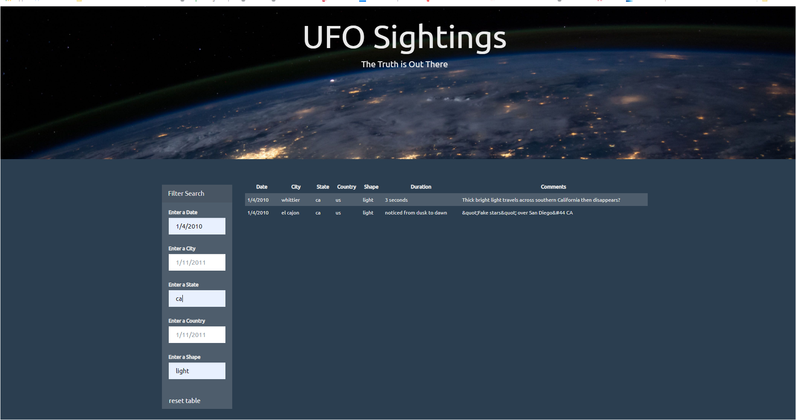

# JavaScript Homework - JavaScript and DOM Manipulation
- - -
* [Enter to my github io link, enjoy!](https://gabbyolivares.github.io/JavaScript-Challenge/)
- - -

## UFO-Sightings

Create a web page with JavaScript, HTML5, CSS3 and D3.js to create tables dynamically utilizing Document Object Model (DOM) programming interface based on a given dataset. Users will also need to filter the table data for specific values based on search criteria
- - -
## Objectives

### Level 1: Automatic Table and Date Search (Required)

1. Create a custom HTML web page

2. Using the UFO dataset provided in the form of an array of JavaScript objects, write code that appends a table to the web page and then adds new rows of data for each UFO sighting

3. Make sure there are columns for `date/time`, `city`, `state`, `country`, `shape`, and `comment` at the very least

4. Use a date form in the HTML document and write JavaScript code that will listen for events and search through the date/time column to find rows that match user input

**Challenge completed!**
Date filter selection

### Level 2: Multiple Search Categories (Optional)

* Complete all of Level 1 criteria.

* Using multiple `input` tags and/or select dropdowns, write JavaScript code so the user can to set multiple filters and search for UFO sightings using the following criteria based on the table columns:

  1. `date/time`
  2. `city`
  3. `state`
  4. `country`
  5. `shape`

**Challenge completed!**
Multiple filter selection

- - -

### Dataset

* [UFO Sightings Data](StarterCode/static/js/data.js)

- - -
**ASSESSMENT**

The final product will be assessed on the following metrics:

Completion of all steps
Visual attraction
Usability

- - -

### Copyright

Trilogy Education Services © 2019. All Rights Reserved.
